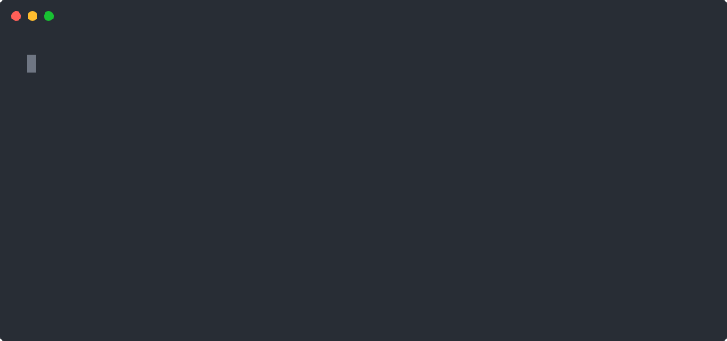

<!-- cspell:words guardrails jsonl mjs bpnpm agenttrailhq backtesting hostnames inspectable -->

<div align="center">

<a href="https://www.agenttrail.sh">
  <picture>
    <source media="(prefers-color-scheme: dark)" srcset="https://www.agenttrail.sh/brand/agenttrail_logo_white.svg" />
    
  </picture>
</a>

# AgentTrail Guard: open-source guardrails for AI coding agents

**Check your AI coding agent's commands and file changes before they run.**<br />
Works with **Claude Code**, **Cursor**, and **Codex CLI**. Local, free, and no account needed.

[](https://github.com/agenttrailhq/guard/actions/workflows/ci.yml)
[](https://www.npmjs.com/package/@agenttrail/guard)
[](LICENSE)
[](https://nodejs.org/)

[Quick start](#quick-start) ·
[Guardrails](#what-guard-catches) ·
[Reference](#reference) ·
[Changelog](CHANGELOG.md)

</div>

[AgentTrail Guard](https://www.agenttrail.sh/agenttrail-guard) is a free, open-source CLI
that connects to your coding agent's hooks and checks every tool call that reaches them
against [74 inspectable guardrails](#what-guard-catches) before it runs. Guard can block a
matching call, send it to you for approval, or record it as a warning, depending on the
agent. When nothing matches, your agent's normal permission flow continues.



## Quick start

**You need:** Node.js 20 or newer, npm, and at least one of Claude Code, Cursor, or Codex CLI.

### 1. Install Guard

```sh
npm install -g @agenttrail/guard
```

### 2. Connect each agent you use

```sh
agenttrail-guard init --agent claude   # Claude Code
agenttrail-guard init --agent cursor   # Cursor
agenttrail-guard init --agent codex    # Codex CLI
```

Each setup is independent, and settings are shared under `~/.agenttrail/guard/`. To see
exactly what `init` would change first, add `--print`; it changes nothing.

`init` demonstrates the engine by evaluating a synthetic `rm -rf /` and showing its
decision. **The command is never executed.** This checks the engine; you still need to
complete your agent's setup below.

### 3. Finish agent setup and check status

- **Claude Code:** restart Claude Code to load the plugin.
- **Cursor:** use the agent in an editor window. Check Cursor's Hooks tab, and restart
  Cursor if Guard's entries do not appear.
- **Codex CLI:** start Codex, open `/hooks`, and approve **each** `agenttrail-guard` entry.
  Guard does not run until you approve it.

```sh
agenttrail-guard status
```

`status` shows what is enforcing in each agent, recent decisions, and settings that need
attention. For Codex, `ON` means the hook is installed and well-formed; confirm approval in
Codex's own `/hooks` screen, because Guard cannot read that state.

### Upgrading and uninstalling

To upgrade, install the latest release, re-run `init` for each agent you use, and restart
that agent. Your settings are kept, and Codex keeps the approval you already gave. Before
1.0, a minor release can include a breaking change, so skim the [changelog](CHANGELOG.md)
first.

```sh
npm install -g @agenttrail/guard@latest
agenttrail-guard init --agent claude   # and again for cursor or codex, if you use them
```

To remove Guard from an agent, run `uninstall` for it. It removes only what Guard added, and
keeps your settings in `~/.agenttrail/guard/`.

```sh
agenttrail-guard uninstall --agent claude   # or: --agent cursor, --agent codex
```

What each step changes is covered in [Updating](#updating) and [Uninstall](#uninstall).

Prefer a guided walkthrough? See the
[AgentTrail Guard installation guide](https://www.agenttrail.sh/get-started/guard).

## Why AgentTrail Guard?


<sub>A real Claude Code session. The agent decides to reset the database to get a schema push
through; Guard blocks `prisma db push --force-reset` with `dd.accept-data-loss` before it runs.</sub>

Your coding agent runs shell commands and edits files all day, faster than you can review
each one. Most of those calls are exactly what you want. The ones that aren't, like
`git reset --hard` over a day of uncommitted work, `rm -rf` on the wrong path,
`terraform apply -auto-approve`, or a read of your `.env`, tend to be the ones you can't take
back. Guard puts a rule-based check on every tool call that reaches its hooks, in every
session, so the risky ones stop and explain themselves before they run, and everything else
carries on as normal.

- **Local, with no account.** Guard runs on your machine and needs no sign-up. Out of the
  box it makes no network calls; the one exception is crash reporting, which is off unless
  you turn it on.
- **Rules you can read.** Every guardrail is plain data with a title, severity, default
  action, and a description of what it deliberately misses.
- **Tunable without turning it off.** Allow one command shape for one rule, change a rule's
  action, disable a pack, or add your own rule.
- **One rule set across agents.** Claude Code, Cursor, and Codex CLI share the same settings
  in `~/.agenttrail/guard/`.
- **See what it caught.** `agenttrail-guard status` shows recent decisions, and `scan` turns
  past agent sessions into a self-contained HTML report.
- **Apache-2.0.** The matching engine and hooks live in this repository; the rule library
  lives in [agenttrailhq/guardrails](https://github.com/agenttrailhq/guardrails).

## How AgentTrail Guard works

1. **Your agent proposes a tool call.** Its hook sends Guard the tool name and inputs.
2. **Guard evaluates it locally.** The engine matches supported command and path fields
   against the bundled guardrails and your custom rules, applying your settings.
3. **Your agent receives a decision.** A matching rule can block, ask, or warn;
   [each agent handles these differently](#block-ask-and-warn).
4. **You can inspect the result.** Matched calls are recorded in a local, scrubbed decision
   log; `agenttrail-guard status` shows recent decisions.

Guard uses rule matching, not an LLM reviewing your code. It can stop a matching call only
when your agent sends it through the installed hooks, it does not inspect file contents, and
it does not guarantee that every dangerous action will be caught. On an internal error it
**fails open**: your agent's normal permission flow continues. Read the
[coverage and runtime limits](#what-the-guard-does-not-do) before relying on it.

## See AgentTrail Guard in action

The table below is real output: each row is a Claude Code `PreToolUse` call passed to
Guard's hook, and the reason Guard returned before anything ran.

| Your agent proposes | Guard's answer to Claude Code |
| --- | --- |
| `git reset --hard origin/main` | **Deny:** agenttrail-guard blocked this: git reset --hard discards uncommitted work (guardrail wt.reset-hard) |
| `terraform apply -auto-approve` | **Ask:** agenttrail-guard needs a person to approve this: Terraform apply/destroy without the confirmation prompt (guardrail pi.terraform-auto-approve) |
| Read `.env` | **Warn:** agenttrail-guard is warning about this: Flag reading a .env file (guardrail block-env-file-read) |
| `npm test` | No output. Claude Code's normal permission flow decides. |
| `git commit -m "docs: explain why rm -rf / is dangerous"` | No output. Mentioning a command is not running it. |

In a real Claude Code session, an agent told it was only dev data reached for
`npx prisma db push --force-reset`, and `dd.accept-data-loss` blocked it before it ran.
[Read the case study](https://www.agenttrail.sh/blog/its-only-dev-data-force-reset).

Every decision names its guardrail, and every guardrail explains itself (the description is
wrapped and trimmed here):

```console
$ agenttrail-guard guardrails show wt.reset-hard

  wt.reset-hard                        working-tree · severity: high
  git reset --hard discards uncommitted work

  Action        block   (shipped default)
  Enforcing     yes

  Discards every uncommitted change in the working tree, irrecoverably — there is no
  reflog for work that was never committed. Does NOT match `git restore` (see
  wt.restore-path), `git checkout -- .` (see wt.checkout-discard) [...]
```

## What Guard catches

Guard ships with **74 guardrails across 11 packs**. Packs are named for the harm they
prevent, not the technique used to spot it. By default, 13 guardrails block, 50 ask, and
11 warn.

| Pack | Rules | Representative examples | Defaults |
| --- | ---: | --- | --- |
| `working-tree` | 9 | `git reset --hard`, `git clean -fd`, force-push, `rm -rf` | 5 block, 4 ask |
| `destructive-data` | 8 | `rm -rf` on an absolute path, dropping a database, destructive SQL, deleting Docker volumes | 5 block, 3 ask |
| `prod-infra` | 8 | `terraform apply -auto-approve`, `kubectl delete`, Helm uninstall or rollback, production config edits | 8 ask |
| `secret-exposure` | 10 | Reading `.env` or credential files, printing tokens, hard-coded secrets in commands, public bucket ACLs | 1 block, 4 ask, 5 warn |
| `rce-supply-chain` | 6 | Piping `curl` into a shell, running code from a URL, TLS verification off, a redirected registry | 1 block, 5 ask |
| `safety-bypass` | 7 | `--no-verify`, admin merges past branch protection, disabling hooks, erasing shell history | 6 ask, 1 warn |
| `privilege-supply-chain` | 6 | `sudo` writes, `chmod 777`, IAM grants, publishing packages, new dependencies | 5 ask, 1 warn |
| `file-scope` | 4 | Writes to system directories, git internals, CI definitions, the agent's own config | 4 ask |
| `agent-context` | 6 | Editing agent instructions or memory, adding MCP servers, installing skills, turning off approvals | 6 ask |
| `test-integrity` | 6 | Deleting tests, blanket snapshot updates, bypassing coverage gates, skip-CI markers | 2 ask, 4 warn |
| `exfiltration` | 4 | Reverse shells, public tunnels, file uploads, paste services | 1 block, 3 ask |

Run `agenttrail-guard guardrails list` for every rule with its current action, or
`guardrails show <guardrail-id>` for one rule in full. The source for every rule is in
[agenttrailhq/guardrails](https://github.com/agenttrailhq/guardrails#the-eleven-packs). To browse
every rule online, or paste a command and see which rules match it, use the
[guardrail library](https://www.agenttrail.sh/guardrails).

### Guard and Guardrails

- **AgentTrail Guard** (this repository, `@agenttrail/guard`) is the tool: the agent hooks,
  the matching engine, the CLI, the local decision log, and the scan report.
- **Guardrails** ([agenttrailhq/guardrails](https://github.com/agenttrailhq/guardrails),
  `@agenttrail/guardrails`) is the rule library: plain data, with matching and non-matching
  examples for every rule.

Guard bundles the library, so you do not need to install it separately. Rules update when
you update Guard; nothing is fetched at runtime.

### Block, ask, and warn

A rule's action decides what happens when it matches. Each agent's hook system supports a
different subset, so the same action can land differently:

| Action | Claude Code | Cursor | Codex CLI |
| --- | --- | --- | --- |
| `block` | Blocks matching hooked calls, with the guardrail's reason | Blocks matching hooked calls | Blocks matching hooked calls; Codex shows the reason |
| `ask` | Requests approval; broad permission allow rules can suppress the prompt | Requests approval for terminal commands; blocks other calls that need approval | Blocks calls that need approval, because Codex runs the action anyway when a hook asks |
| `warn` | Allowed, with a warning message | Allowed with no message; recorded locally | Allowed; shown in the terminal UI, not in `codex exec` |

Every match is recorded in the local decision log, which `agenttrail-guard status` reads.

## Tune a guardrail

A guardrail that fires on something legitimate should get narrower, not switched off.
`status` identifies the rule that fires most often and suggests a command to allow that
specific pattern. Start by reading the rule:

```sh
agenttrail-guard status
agenttrail-guard guardrails show <guardrail-id>
```

### Allow one command shape

For a repeat false positive, prefer a narrow exception. `allow` silences only the named rule
for matching commands; the rule keeps enforcing everywhere else, and every other rule is
untouched. Review the pattern `status` suggests before applying it.

```console
$ agenttrail-guard guardrails allow require-approval-rm-rf "rm -rf ./tmp"
Allowlisted. require-approval-rm-rf no longer matches "rm -rf ./tmp".
The guardrail still fires on everything else, and the other 73 guardrails are unchanged.
```

It refuses a pattern broad enough to disable the rule quietly:

```console
$ agenttrail-guard guardrails allow require-approval-rm-rf "*"
agenttrail-guard guardrails allow: refusing that pattern — it also matches `ls -la`, `git status`, `pnpm install` and 3 more, which this guardrail has nothing to do with. That is a global mute for this guardrail, not a silence for one shape — the guardrail would keep showing as enabled while enforcing nothing.
```

### Change an action, or restore the default

```sh
agenttrail-guard guardrails set-action <guardrail-id> warn   # record, don't stop
agenttrail-guard guardrails reset <guardrail-id>             # back to the shipped default
agenttrail-guard guardrails reset --all                      # undo every change you made
```

`warn` records the match without blocking the call. `reset --all` never touches rules you
added yourself.

All bundled packs are enabled by default. Your changes take effect on the next tool call. A
new pack shipped in an update is enabled unless you disable it.

### Add your own rule

Write a rule with at least one command it must match (`block`) and one it must not
(`allow`):

```json
{
  "id": "team.deploy-prod-script",
  "category": "prod-infra",
  "severity": "high",
  "defaultAction": "require_approval",
  "title": "Our production deploy script",
  "description": "Holds `pnpm deploy:prod` for approval. Does not match the staging script.",
  "match": {
    "any_of": [
      {
        "kind": "execute_tool",
        "label": "Bash",
        "detail_matches": ["\\bpnpm\\s+(run\\s+)?deploy:prod\\b"]
      }
    ]
  },
  "fixtures": {
    "block": ["pnpm deploy:prod", "pnpm run deploy:prod"],
    "allow": ["pnpm deploy:staging"]
  }
}
```

Validate it against Guard's own evaluator, then add it:

```console
$ agenttrail-guard guardrails validate my-rule.json
Valid. team.deploy-prod-script (ask)
    block fixture   pnpm deploy:prod             → matched   PASS
    block fixture   pnpm run deploy:prod         → matched   PASS
    allow fixture   pnpm deploy:staging          → not matched   PASS

  Schema checked with the same `parseRule` CI runs. Fixtures were run through the
  guard's own evaluator — the one that will run on your machine.

$ agenttrail-guard guardrails add my-rule.json
```

In JSON, "ask" is written `require_approval`. The CLI accepts `ask`, but a hand-edited file
does not. See [Managing guardrails](#managing-guardrails) for every rule
command, and the
[guardrails rule format](https://github.com/agenttrailhq/guardrails#a-rule-start-to-finish)
for all fields.

## Scan past sessions

Your agents already keep session transcripts on disk. `scan` replays the recorded tool
calls through your current guardrails and writes a local report:

```sh
agenttrail-guard scan --agent claude   # reads ~/.claude/projects
agenttrail-guard scan --agent cursor   # reads ~/.cursor/projects/*/agent-transcripts/
agenttrail-guard scan --agent codex    # reads ~/.codex/sessions
```

You get a summary in the terminal and a single self-contained
`agenttrail-guard-report.html`, opened in your browser (`--no-open` to skip, `--out <file>`
to choose where, `--json` for JSON only). The report loads nothing from outside itself.

**A scan shows what would match now, not what was blocked then.** It applies today's
guardrails and settings to past calls, so its results can differ from what Guard enforced
during those sessions, or from sessions that ran before Guard was installed.

Reports redact secrets, paths, and known identifying values, but redaction is not a
guarantee. Use `--review` and read the report before sharing it. The review output can
include raw MCP values that the report itself redacts. Details:
[Seeing what already happened](#seeing-what-already-happened).

## The commands

| Command | What it does |
| --- | --- |
| `agenttrail-guard init --agent <claude\|cursor\|codex>` | Install the integration, seed settings, and demonstrate the engine. Safe to re-run. |
| `agenttrail-guard status` | Inspect installation state, recent decisions, and settings that need attention. |
| `agenttrail-guard guardrails` | List, inspect, customize, and validate guardrails. |
| `agenttrail-guard scan --agent <claude\|cursor\|codex>` | Check past sessions and create a local HTML report. |
| `agenttrail-guard crash-report` | Manage opt-in crash reports. Off by default. |
| `agenttrail-guard uninstall --agent <claude\|cursor\|codex>` | Remove that integration and keep your settings. |

Run `agenttrail-guard --help` for CLI help, or `agenttrail-guard guardrails --help` for rule
management.

## Agent support

Guard runs in all three agents through each agent's own hooks, so coverage differs by agent.
These are the behaviors documented and measured in this repository; see the detailed limits
before relying on an integration. How each agent handles `block`, `ask`, and `warn` is in
[Block, ask, and warn](#block-ask-and-warn).

| Agent | Setup and coverage notes |
| --- | --- |
| Claude Code | Installed as a plugin. [Coverage limits](#what-the-guard-does-not-do). |
| Cursor | Use an editor window. Sandbox and allowlist settings can bypass checks. Cursor cloud agents are outside its coverage. [Cursor's limits](#cursors-limits). |
| Codex CLI | Approve every entry in `/hooks`. Measured on 0.154.0; Windows and Codex Desktop are unverified. Codex Cloud is outside its coverage. [Codex's limits](#codexs-limits). |

## Privacy at a glance

- **Reads:** the tool call your agent is about to make: its tool name, command, and file
  path. `scan` also reads the transcripts already on your disk.
- **Keeps:** your settings and a scrubbed decision log in `~/.agenttrail/guard/`, capped
  at 1 MiB, with older records dropped past 30 days. Clear it with
  `agenttrail-guard status --clear-history`.
- **Sends:** nothing by default. Crash reporting is opt-in, sends stack traces only, and
  ships with no endpoint configured.

Scrubbing catches common secrets but is not complete: see the limits below and
[Files it keeps](#files-it-keeps). The AgentTrail website summarizes
[what Guard reads, keeps, and sends](https://www.agenttrail.sh/security#guard).

## What the guard does not do

Guard depends on the hooks and permission behavior of each agent. It cannot check actions
that bypass those hooks or detect dangerous content inside a written file. In short:

- It checks only calls that reach its hooks. Actions outside hooked tools are invisible,
  and Cursor and Codex have more of these gaps than Claude Code.
- It matches commands and file **paths**, never file contents. An agent can write a script
  and run it as a separate command; only the command is checked.
- It does not see what the agent fetches from the web.
- It **fails open**. A crash, a timeout, or bad output lets the call through to your
  agent's normal permission flow.
- An `ask` can be skipped by your agent's own allow settings, and becomes a block on Codex.
- Redaction in the log and report is good, not complete.

<details>
<summary>General coverage, permission, and redaction limits</summary>

Read this before you rely on it. A security tool that overstates its coverage is
worse than one that names the hole.

- **The guard does not see what the agent fetches from the web.** `WebFetch` is not
  intercepted, and there are no website guardrails in v1. The underlying engine can
  match on a command string and on a file path (it has no matcher for a URL), so a
  URL guardrail would have validated, installed, and then matched nothing, forever,
  without telling anyone. Rather than ship a channel whose guardrails only appear to
  work, v1 leaves web traffic out and says so here. `WebSearch` **is** covered,
  because a search query is ordinary text on the command channel.
- **It does not stop an action it cannot see.** The guard runs as a Claude Code
  `PreToolUse` hook, as Cursor `preToolUse` and `beforeShellExecution` hooks, and as
  Codex `PreToolUse` and permission-request hooks. Anything the agent does outside a
  hooked tool is invisible to it, and the other two apps have more of these gaps than
  Claude Code: see [Cursor's limits](#cursors-limits) and
  [Codex's limits](#codexs-limits).
- **A file guardrail matches the PATH, not the file's contents.** The engine reads a
  command string and a file path; it has no matcher for what a write PUTS in a file. So a
  guardrail on `Write` or `Edit` decides only by where the write lands, never by what it
  contains, and **write-then-execute falls in the gap**: an agent can write a script (judged
  by its path alone, its contents unseen) and then run it as a separate command. The run is
  checked like any command, but if that command does not itself match a guardrail
  (`./setup.sh`, say), the dangerous content that went into the file was never inspected.
  Guard what a file's contents would DO by guarding the commands that act on it; a file-path
  guardrail is a scope rule, not a content scanner.
- **A hold does not prompt when your settings already allow the tool.** A guardrail set
  to `require_approval` (shown as `ask`) returns Claude Code's `ask` decision, but Claude
  Code's own `permissions.allow` rules win over a hook: if your `settings.json` allows a
  tool outright (`"Bash"`, `"Read"`, `"Edit"`), a call to that tool runs with no prompt,
  and the hold never reaches you. The guard cannot change this, because Claude Code
  decides, and the hook cannot see that it happened, so the call is still recorded as a
  hold. `status` and `init` read your `settings.json` and tell you how many holds this
  silences, naming the tools; a scoped allow like `"Bash(git:*)"` is narrower and is not
  counted.
- **It does not redact what it lets through.** The guard decides about a command; it
  never rewrites one. Secrets are redacted from what the guard itself *writes* (the
  decision log, the `scan` report and a crash report all go through the scrubber), but
  a command that contains a secret and is allowed still runs exactly as the agent
  wrote it.
- **Its redaction is good, not complete.** Every command written to `events.jsonl` is
  scrubbed first: AWS keys, GitHub and Slack tokens, JWTs, private keys, connection
  strings, `.env`-style assignments, emails, and card numbers all become
  `[REDACTED:…]`. What it does **not** catch is a secret passed as a bare command-line
  argument, with no `=` or `:` between the name and the value: the patterns are
  anchored to an assignment, so `--token abc123` reads as two ordinary words. Treat
  the log as scrubbed, not sanitized. (The `scan` **report** goes further and does
  redact a secret handed to a long flag such as `--token`, `--password`, `--key` or
  `--vendor-key`, a value after a name ending in `_KEY` or `-key`, an `Authorization`
  header, and any long random-looking string; the decision log does not.)
- **The `scan` report's name redaction is a deny-list for shell commands and an
  allow-list for MCP.** Paths are redacted structurally, so that rule is total. Shell
  names are not; the identifier redactor knows a fixed list of tools: container
  runtimes, `kubectl` (resource names included), the database clients (host, database,
  and the SQL passed to `-c` / `-e`), `ssh`, `git` commit messages and identity
  settings, 1Password's `op` (item and vault names), and `gh` titles and bodies; and it
  also redacts, in any command, a secret handed as a flag value (`--token`,
  `--password`, `--key`), a UUID, a heredoc body (which becomes `<message>`), and the text
  of a `#` comment. Cloud account identifiers are redacted where a name or flag gives
  them away: `CLOUDFLARE_ACCOUNT_ID` and `--account-id`, any 32-hex operand of a
  `wrangler` command, an AWS account number after `--account` or inside an ARN,
  `--project` for `gcloud`, `gsutil`, `bq` and `firebase`, and the login in
  `ssh -o User=`. A bare
  operand naming a resource for a tool *not* on the list
  survives, and a branch or tag given as a plain `git` operand (`git checkout my-branch`,
  `git tag -a v1`) is kept readable on purpose, as is a bare folder name (`cd my-app`,
  `git -C my-app`). A **glued** short-flag password
  (`mysql -pSECRET`) is not caught: only long secret flags and `.env`-style assignments
  are. An `mcp__…` payload is handled the opposite way: every value is redacted to
  `<value>` by default and only the field names are kept, so no raw payload value reaches
  the file.
- **A secret in the `scan` report is caught by format, by name and by shape, and the last two
  are guesses.** After the known formats, a value that follows a name ending in `_KEY` or
  `-key`, a raw `Authorization` header, and any run of 32 or more letters, digits, `-` and
  `_` that looks random is masked, the last as `[REDACTED:secret:generic]`. A secret
  shorter than 32 characters with no revealing name, a secret that is only hexadecimal
  (a hex key looks like a commit hash or a digest, so hex is masked only under a name or
  flag), a secret split by `+ / .`, an unnamed secret followed by a `.`, an unnamed secret
  that ends in `=`, and an unnamed lower-case key written as short dashed groups (four or
  five characters each) can survive; a run that spells out a pod or release name (three or
  more deployment words such as `prod`, `canary` or `west`, every segment short) is left
  readable. Redaction is best effort, not a guarantee: read the report, or run
  `scan --review`, before you share it.
- **A guardrail's id and title are printed as their author wrote them.** For the shipped
  library that is our words. For a guardrail *you* added to `guardrails.json` it is yours,
  and nothing redacts it: a title reading "AcmeCorp internal audit" appears in the report
  verbatim. Paths and secrets pasted into a title *are* taken out (the title goes
  through the same three passes as a command), but a name you chose is not something a
  redactor can distinguish from a word. Run `scan --review` to read every line, commands
  and guardrail names both, before the file is written.
- **The 30-day limit on the decision log is a ceiling, not a sweep.** Old records are
  dropped when the log is compacted, and compaction happens when it crosses 1 MiB. On
  a machine that stops using Claude Code and Cursor, the last half-megabyte of records
  stays until either another decision is recorded or you run `status --clear-history`.
  The bound that always holds is the size one.
- **It is one developer on one machine.** Nothing syncs, nothing is shared with a
  team, and there is no approval queue.

</details>

### Cursor's limits

<details>
<summary>Cursor coverage and permission behavior</summary>

Cursor's hooks see less than Claude Code's. In Cursor, the guard does not check these:

- **Reads that Cursor shows as "Explored".** No hook runs for them, so a guardrail on a
  file path does not see them.
- **Files Cursor has already attached to the conversation.** Cursor puts rule and
  instruction files into the agent's context itself, with no tool call, so no hook fires.
  The agent can then quote such a file even where a guardrail denies reading it: a
  guardrail on a file path cannot stop content Cursor has already attached.
- **Everything a search can reach.** A `Grep` is checked on its folder, and on the folder
  joined to its glob, so a search for `**/.env` under a project is checked as that path.
  A brace glob such as `{.env,.env.local}` is not expanded, and searching the contents of
  files under a folder is not covered: the search pattern is not read.
- **Tab edits.** Edits made with Cursor Tab are not covered.
- **The Agent Window.** It can skip hooks. Use Cursor's agent in an editor window;
  `status` reminds you.
- **Approval, except for terminal commands.** Cursor shows its approval card for a
  terminal command when the guard asks at `beforeShellExecution`. It does not enforce an
  `ask` from `preToolUse`, so a guardrail that asks for approval of a file edit, a read,
  a `Grep`, a `Delete` or an MCP call blocks that call instead, with the message
  "agenttrail-guard needs a person to approve this, and Cursor cannot ask: " and the
  guardrail's title and id.
- **A terminal command that Cursor's own run mode runs first.** This is the Cursor analogue
  of Claude Code's "a hold does not prompt when your settings already allow the tool" (above).
  In a **sandbox** run mode many commands run automatically with no card, and such a command
  can bypass `beforeShellExecution` entirely, so the guard never evaluates it and there is no
  `events.jsonl` record either. A command the sandbox cannot run (one that needs the network,
  or writes outside it) is escalated to approval, where the guard does check it; so coverage
  under a sandbox run mode is partial, and decided by Cursor, not by the guardrails. For the
  guard to check **every** terminal command, use a non-sandbox run mode (Cursor's allowlist
  mode without the sandbox), and keep the commands you want checked off Cursor's command
  allowlist. Unlike Claude Code's `settings.json`, there is no documented, stable file for the
  guard to read the run mode from, so `status` and `init` name the effect but cannot count it.
  When the hook does run, the decision is recorded in `events.jsonl`.
- **Showing warnings.** A guardrail that warns is answered with no opinion. The match is
  written to `events.jsonl` and counted by `status`, and Cursor shows nothing.
- **Being named in the agent's reply.** Cursor shows no reason of its own, so what you read
  is the agent retelling what it was handed. Every message names the guard, the guardrail's
  title and its id, and the agent's copy also asks for the line to be repeated as it stands,
  but the agent writes its own reply and may drop the name. Measured on Cursor 3.20.21:
  the verdict was always right and the wording was the agent's own. `status`, `events.jsonl`
  and `scan` are where each decision is recorded exactly.
- **Cursor's cloud agents.** They do not run user-level hooks, and the guard's entries
  are in your user-level `~/.cursor/hooks.json`.

**The guard's Claude Code plugin inside Cursor.** With Cursor's "Include third-party
plugins" setting on, Cursor can run the guard's Claude Code plugin and hand it Cursor's
payload. The plugin reads that as a Cursor call, and it still blocks what a guardrail
blocks.

- When both of the guard's Cursor entries are in `~/.cursor/hooks.json`, the plugin
  leaves approvals and the decision log to them, so each decision is asked for and
  logged once.
- Without them, the plugin is the only checkpoint. It blocks any call that needs
  approval, terminal commands included, with "agenttrail-guard needs a person to approve
  this, and Cursor cannot ask: " and the guardrail's title and id, and it logs every
  decision itself.

</details>

### Codex's limits

<details>
<summary>Codex CLI coverage, hook approvals, and tested version</summary>

A deny reaches Codex intact: the command never runs, and Codex prints the guard's own
reason on screen and the model repeats it. What differs is what the hook can see, what
it can ask for, and what happens before you approve it. Everything below is measured on
**codex-cli 0.154.0**.

- **Nothing runs until you approve the guard in `/hooks`.** An installed-but-unapproved
  entry never fires. The command runs normally, no decision is recorded, and neither
  Codex nor the guard mentions it: the only symptom of an unguarded machine is
  silence. `status` cannot close this gap for you, because approval is recorded in a
  file the guard does not read.
- **Changing an installed entry silently un-approves it.** Codex trusts the entry's
  content, so editing the command, the timeout or the matcher by as little as one
  character stops the hook firing, with no warning and no log line, until you approve
  it again. That is why the installed entry is frozen and pinned by a test, and why a
  guard release ships a new *script* rather than a new entry. Putting the entry back
  exactly as it was restores the approval by itself.
- **An approval becomes a block.** Codex parses a hook that asks for human approval,
  marks the hook run as failed, and **runs the action anyway**, so asking would be the
  same as saying nothing. The guard therefore refuses a call it would have held on
  Claude Code, and says in the reason that a person has to approve it. 50 of the 74
  bundled guardrails ask rather than block, so this is the difference you will meet
  most often. Downgrade any of them in `~/.agenttrail/guard/config.json`, or with
  `guardrails set-action <id> warn`, if a block is too strong for your work.
- **Reads fire no hook at all.** Codex has no read tool: it reads files by running
  shell commands. A guardrail on a *file path* therefore never sees a read, and the
  read is only checked as far as its command text goes. The paths a file guardrail does
  see are the ones inside an edit.
- **An edit written through the shell carries no path.** Codex's editing tool sends the
  patch, and the guard reads the paths out of it. An edit the agent writes as a shell
  command instead (a heredoc into `cat`, a `sed -i`, a redirect) arrives as an
  ordinary command with no path field anywhere, so only the command guardrails apply to
  it. Every app here has this gap; it is wider on Codex because the shell is the route
  for more of what the agent does.
- **Every failure lets the action through, and there is no switch for that.** A crash,
  a non-zero exit other than 2, output that is not JSON, one field Codex does not
  recognise, or a hook that runs past its timeout: each is recorded as a failed hook
  run and the tool call proceeds. Codex offers no fail-closed setting, so a guard that
  cannot answer is a guard that is not there. It is also why the hook answers with
  exactly three fields and waits on nothing.
- **A warning is invisible in `codex exec`.** In Codex's terminal UI a warning shows as
  a hook line above the command. In a scripted `codex exec` run the text appears
  nowhere at all: only that the hook completed. The match is still written to
  `events.jsonl` and counted by `status`, which is where a warning is reliably read.
- **MCP tool calls are unverified here.** The guard checks a Codex MCP call by the same
  `mcp__server__tool` name Claude Code uses, taken from Codex's own source. No MCP
  server was configured on the machine these measurements come from, so that path is
  reasoned rather than observed.
- **Windows and Codex Desktop are unverified.** Both appear in open reports of denies
  being ignored, and neither was exercised here.
- **A shell tool under another name is seen but not read.** The guard's entry matches
  every tool, so the hook does run, but the guard understands three shapes on Codex:
  the shell tool named `Bash`, an edit through `apply_patch`, and an MCP call named
  `mcp__server__tool`. Anything else yields no verdict and **no line in the decision
  log**, so it is neither checked nor recorded. This is not hypothetical: Codex Desktop
  reports its shell tool as `shell_command`, which means the guard would not check
  commands there at all.
- **Codex Cloud is not covered.** It runs on OpenAI's machines and not yours, so it
  never reads `~/.codex/hooks.json` and the guard is not in the loop at all.
- **An enterprise-managed config can switch user hooks off entirely.** With
  `allow_managed_hooks_only = true` set in a managed configuration, Codex runs only the
  hooks that configuration provides and skips yours, the guard's included. There is no
  message about it; the guard simply never fires.
- **0.154.0 is the tested floor.** Every behaviour above was measured on that version.
  Codex's hook surface is young and moving, so treat a newer release as unverified
  until a deny, an approval and a warning have each been seen on it.

</details>

## AgentTrail Guard and AgentTrail OS

Guard is a complete, standalone tool. You can install it, use it, and contribute to it
without an AgentTrail account. Installing Guard does not connect your sessions to
AgentTrail OS.

[AgentTrail](https://www.agenttrail.sh) also makes
**[AgentTrail OS](https://www.agenttrail.sh/agenttrail-os)**, for developers and
teams who also want a searchable record of every agent session. Both products use the same
open rule library.

| | [AgentTrail Guard](https://www.agenttrail.sh/agenttrail-guard) | [AgentTrail OS](https://www.agenttrail.sh/agenttrail-os) |
| --- | --- | --- |
| Where decisions are made | On your machine, from the bundled library | On AgentTrail's servers, from your organization's policies |
| Account | None | Required |
| Agents | Claude Code, Cursor, Codex CLI | Claude Code, Cursor |
| Your own rules | A local JSON file | Authored in the app |
| History | A capped local log, plus on-demand scan reports | Searchable session history |
| For teams | One developer, one machine | Synced rules, policy backtesting, approvals, and an audit trail, depending on plan |
| When something breaks | Fails open: your agent's normal permission flow continues | Fails closed: the action does not proceed |

Not sure which fits? See
[AgentTrail Guard vs AgentTrail OS](https://www.agenttrail.sh/guard-vs-os) for a detailed
comparison, or [get started](https://www.agenttrail.sh/get-started) with either.

## Troubleshooting

| What you see | What to check |
| --- | --- |
| `agenttrail-guard` is not found | Check that Node.js 20+ is installed and your npm global executable directory is on `PATH`. Reopen the terminal after installation. |
| `init`'s demo works, but the agent is not checked | Finish the agent-specific setup in [Quick start](#quick-start). The demo checks the engine, not the live hook connection. |
| `status` reports `BROKEN` | Read the named problem and re-run `init --agent` for that agent. This refreshes the hook copy and its Node path. |
| Codex reports `ON`, but calls are not checked | Open `/hooks` in Codex CLI and approve every Guard entry. `ON` reports installation state, not approval. |
| An `ask` rule never prompts in Claude Code | A broad `permissions.allow` entry in `settings.json` can skip the prompt. `status` names the tools affected. |
| A legitimate command keeps matching | Inspect the rule with `guardrails show`, then add a narrow exception or change its action. See [Tune a guardrail](#tune-a-guardrail). |
| A scan differs from a past decision | Scans apply your current guardrails to recorded calls; rules and settings may have changed since the session. |

If the issue persists, [open a Guard issue](https://github.com/agenttrailhq/guard/issues)
with the details listed in
[CONTRIBUTING.md](CONTRIBUTING.md#reporting-a-bug-or-a-false-positive).

## FAQ

**Can I use Guard in a team?**
Teammates can each install Guard and share custom rule files through your own repository.
Guard's settings are per developer and per machine; nothing syncs.
[AgentTrail OS](https://www.agenttrail.sh/agenttrail-os) is built for shared policies.

**What if I already use the `agenttrail` Claude Code plugin?**
`init --agent claude` detects it and stops, rather than installing a second hook that
decides on the same tool call.

## Contributing

Found a false positive, a missed command, or have an idea? Contributions of every size help,
code or not. [CONTRIBUTING.md](CONTRIBUTING.md) explains which repository each report
belongs in, how to build and test Guard, and how the code is laid out. Please follow the
[Code of Conduct](CODE_OF_CONDUCT.md), and report vulnerabilities privately as described in
[SECURITY.md](SECURITY.md).

## Reference

The full reference lives in this README, and most sections are collapsed so you can open
just the one you need:

- **Setting up:** [Install](#install), [Updating](#updating), [Uninstall](#uninstall), and
  [what `status` shows](#what-status-shows).
- **Day to day:** [managing guardrails](#managing-guardrails),
  [seeing what already happened](#seeing-what-already-happened), and
  [crash reporting](#crash-reporting).
- **Guarantees and limits:** [what the guard does not do](#what-the-guard-does-not-do),
  [rules of the runtime](#rules-of-the-runtime), and [files it keeps](#files-it-keeps).

## Install

<details>
<summary>What each integration installs and changes</summary>

If you already have the `agenttrail` plugin installed, `init --agent claude` tells you
and stops to avoid installing two hooks that decide on the same tool call.

**Claude Code.** `init --agent claude` does two things, and nothing else. It writes its
own two files under `~/.agenttrail/guard/`, and it asks Claude Code to install the hook
as a plugin. **It never touches the `hooks` block in your `settings.json`**; Claude
Code owns that file, and the guard's hook lives inside the plugin instead.

**Cursor.** `init --agent cursor` writes the same two files, copies the hook to
`~/.agenttrail/guard/cursor/guard-hook.mjs`, and adds two entries to Cursor's user hooks
file, `~/.cursor/hooks.json`: one under `preToolUse` and one under
`beforeShellExecution`. Each runs the copy with the Node that ran `init`, named by its
absolute path, with a 10-second timeout. It does not run Claude Code.

- Every other key and entry in `~/.cursor/hooks.json` is kept, in order.
- It refuses, and changes nothing, when that file is not a JSON object, has a `version`
  other than 1, has a hook list that is not an array, or is read-only.
- It never reads or writes a project's `.cursor/hooks.json` or an enterprise hooks file.
- If that Node is later moved or removed, `status` reports the install as `BROKEN`; run
  `init --agent cursor` again.

Cursor reloads `hooks.json` by itself. If the guard's entries do not show in Cursor's
Hooks tab, restart Cursor. Use Cursor's agent in an editor window, and read
[Cursor's limits](#cursors-limits) before you rely on it.

**Codex CLI.** `init --agent codex` writes the same two files, copies the hook to
`~/.agenttrail/guard/codex/guard-hook.mjs`, and adds the guard's entries to Codex's
user hooks file, `~/.codex/hooks.json`: one for the pre-tool event and one for the
permission-request event. Each runs the copy with the Node that ran `init`, named by
its absolute path. It does not run Codex.

- Every other key and entry in `~/.codex/hooks.json` is kept, in order, and the
  guard's entries are **appended, never inserted**. Codex identifies an approval by
  an entry's position in the file, so moving one would revoke it.
- The guard registers there and **nowhere else**. Codex also reads a `[hooks]` table
  in `~/.codex/config.toml`, and the two sources add together rather than override,
  so an entry in both would run the guard twice on every call.
- It refuses, and changes nothing, when that file is not a JSON object, has a hook
  list that is not an array, or is read-only. It never reads or writes a project's
  `.codex/hooks.json` or an enterprise-managed hooks file.
- If that Node is later moved or removed, `status` reports the install as `BROKEN`; run
  `init --agent codex` again.

**Then approve the guard inside Codex, or none of this runs.** Start Codex, type
`/hooks`, and approve each `agenttrail-guard` entry; Codex reviews each one
separately. Until you do, the install is complete and **completely inert**: the hook
never fires, every command goes through unchecked, and neither Codex nor the guard
says a word about it. The guard cannot approve itself, because writing Codex's trust
record for it would defeat the review that record exists for. Measured on codex-cli
0.154.0, and it applies again after any change to an entry; read
[Codex's limits](#codexs-limits) before you rely on it.

`init` finishes by running a synthetic `rm -rf /` through the real guardrail engine and
showing you it being blocked. Nothing is executed; it is a demonstration, so you can
see it work before anything real runs through it.

Want to look before you leap? `npx @agenttrail/guard@latest init --agent claude --print`
(or `--agent cursor --print`, or `--agent codex --print`) shows you exactly what it
would do and changes nothing.

</details>

### Updating

<details>
<summary>Update the package and refresh each integration</summary>

A new release can add guardrails and whole packs. Every pack is on unless you turned it
off, so a pack added in a release you install starts enforcing with no step of its own.
The update itself is two steps, for each app you use:

1. Get the new release and re-run `init` with it. Your settings in `~/.agenttrail/guard/`
   are kept.

   ```sh
   npx @agenttrail/guard@latest init --agent claude   # Claude Code
   npx @agenttrail/guard@latest init --agent cursor   # Cursor
   npx @agenttrail/guard@latest init --agent codex    # Codex CLI
   ```

   If you installed the command globally, run `npm install -g @agenttrail/guard@latest`,
   then `agenttrail-guard init --agent claude`, `agenttrail-guard init --agent cursor` and
   `agenttrail-guard init --agent codex`.
2. Restart the app. Claude Code runs its own cached copy of the plugin and keeps running
   the old one until it restarts; restart Cursor too if the guard's entries do not show in
   its Hooks tab.

**A new release does not cost you a second Codex approval.** Codex trusts the *entry*
(the command, its timeout and its matcher) and not the script that entry runs, so a
release that ships a new hook keeps the approval you already gave. That is also why the
entry is frozen: changing it would silently revoke the approval and leave you unguarded
until you noticed. See [Codex's limits](#codexs-limits).

`status` tells you when a step was missed: it names the version Claude Code is running when
that differs from the guard you have installed, and says when the Cursor or Codex install
was made by a different version. If the app is running a newer guard than the command you
ran `status` with, it says that command is the one out of date, rather than suggesting an
`init` that would downgrade the app.

</details>

### Uninstall

<details>
<summary>Remove an integration and keep your settings</summary>

```sh
npx @agenttrail/guard@latest uninstall --agent claude
npx @agenttrail/guard@latest uninstall --agent cursor
npx @agenttrail/guard@latest uninstall --agent codex
```

For Claude Code it removes the guard's plugin, and only that. For Cursor it removes only
the guard's two entries from `~/.cursor/hooks.json`, and for Codex only the guard's
entries from `~/.codex/hooks.json`:

- if the rest of the file still matches what was there before the install, the earlier
  file is put back exactly;
- if there was no file before and nothing else is left, the file is deleted;
- otherwise every other hook stays as it is.

It then deletes the hook copy and the other files under `~/.agenttrail/guard/cursor/` or
`~/.agenttrail/guard/codex/`. All three are safe to re-run, and all three leave your
settings in `~/.agenttrail/guard/`.

One thing to know before uninstalling from Codex: removing the guard's entries moves
every entry after them up the file, and Codex identifies an approval by position. Any
other tool's hook that sat below the guard's therefore needs approving again in
`/hooks`. `uninstall` says so when there is one.

</details>

## What `status` shows

<details>
<summary>Installation checks, version checks, and decision history</summary>

`status` takes no `--agent`. It prints a section for Claude Code, one for Cursor, one
for Codex CLI, and then what applies to all three.

**Claude Code**

- `Claude Code: not found` when the `claude` command cannot be started, and then no
  plugin state is read.
- Otherwise `Enforcement: ON` with the number of guardrails and how many of the library's
  packs are on (`across 11 of 11 packs`), `OFF` when the plugin is installed but
  disabled, or `NOT INSTALLED` with the command that installs it.
- When it is on, the cached copy Claude Code is running (`Active bundle:`), and a line
  when that copy is a different version from the guard running `status`: when the copy
  is older, the command that refreshes it and the reminder to restart Claude Code; when
  it is newer, that the command you ran is out of date.
- The guardrail library's version and how long ago it was published.
- A `PROBLEM` line when the plugin's recorded source is missing, with the one command
  that fixes it.

**Cursor**

- `Enforcement: ON` when both of the guard's entries are in `~/.cursor/hooks.json`, and
  the Node and the hook copy they run both exist.
- `NOT INSTALLED` when there is no guard entry, with the command that installs it.
- `BROKEN` when only one of the two entries is there, an entry runs a command in a form
  the guard does not write, the Node or the hook copy is missing, or the file cannot be
  read as a hooks file. It names the first problem it finds and tells you to run
  `init --agent cursor` again. A Cursor hook that cannot run lets every call through and
  shows nothing in Cursor, so this is where you find out.
- When the guard is installed, `ON` or `BROKEN`: a line when the install was made by a
  different guard version from the one running `status`, and a reminder to use an
  editor window, because Cursor's Agent Window can skip hooks.

**Codex CLI**

- `Enforcement: ON` when the guard's entries are in `~/.codex/hooks.json`, and the
  Node and the hook copy they run both exist.
- `NOT INSTALLED` when there is no guard entry, with the command that installs it.
- `BROKEN` when only some of the guard's entries are there, an entry runs a command in
  a form the guard does not write, the Node or the hook copy is missing, or the file
  cannot be read as a hooks file. It names the first problem it finds and tells you to
  run `init --agent codex` again.
- A warning when a guard entry has moved from where `init` put it. Codex identifies an
  approval by an entry's position in the file, so an entry another tool pushed down
  reads perfectly and is no longer trusted.
- **It cannot tell you whether Codex trusts the guard**, and says so rather than
  guessing. Approval is recorded in `~/.codex/config.toml`, which the guard does not
  read: it ships no TOML parser and will not grow one to read a file it never writes.
  `ON` here means installed and well-formed; whether it is *running* is answered only
  by Codex's own `/hooks` screen.
- When the guard is installed, `ON` or `BROKEN`: a line when the install was made by a
  different guard version from the one running `status`.

**All three**

- In each section, when there is at least one, the number of crash records from the
  guard's hook and the newest one's time. A record does not say which app ran the hook,
  so every section shows the same count, labelled as shared.
- Your own guardrails that are invalid, and settings in `config.json` that were ignored,
  including a pack name in `disabledPacks` that matches no pack, and an `enabledPacks`
  key left by an older release, which is no longer read.
- The last five decisions, each with the decision, the app that sent the call (`claude`,
  `cursor` or `codex`), the guardrail id and the command; then the guardrail that fired
  most, with the one line that silences it for that command.

</details>

## Managing guardrails

<details>
<summary>Rule commands, actions, allow patterns, and pack settings</summary>

When one guardrail fires repeatedly on something legitimate, `agenttrail-guard guardrails`
fixes it without hand-editing JSON or uninstalling.

```
guardrails list [--pack <name>] [--enabled|--disabled]   what is on, and what is not
guardrails show <guardrail-id>                           everything about one guardrail
guardrails enable|disable <guardrail-id|pack>            turn a guardrail or a whole pack on/off
guardrails set-action <guardrail-id> block|ask|warn      change what a guardrail does
guardrails add <file.json>                               install a guardrail you wrote
guardrails remove <guardrail-id>                         delete one of your own guardrails
guardrails allow <guardrail-id> <pattern>                silence ONE guardrail on ONE shape
guardrails reset [<guardrail-id>|--all]                  undo your changes
guardrails validate [<file>]                             the same check CI runs
```

Shared flags: `--json`, `--quiet`, `--config <dir>`.

**`allow` is the one that matters.** It suppresses one guardrail on one command shape
and nothing else: the same guardrail keeps blocking everything else, and the others are
untouched. `agenttrail-guard status` names the guardrail that has been firing most and
prints the exact line to paste.

It will **refuse** a pattern that would quietly do more than you asked. `*`, `**` and
anything starting with `!` match every command, so allowlisting one would disable that
guardrail entirely while `guardrails list` still showed it enabled. It also refuses a
pattern that is one of the guardrail's own block fixtures (a command it exists to stop)
because silencing that shape would blind the guardrail to its own purpose. Patterns are
matched in `/`-separated segments, so no `*` crosses a `/`; give `**` a segment of its own
(`./generated/**`) to cover a subtree.

**One word to get right.** You type `ask`, and the tool prints `ask`, but the value
stored in `config.json` and `guardrails.json` is `require_approval`. That is the vocabulary
the guardrail engine uses. Writing `"ask"` into either file by hand does not work:
`guardrails.json` reports it as invalid, and `config.json` **silently ignores it**, which is
why `status` now lists settings it had to drop.

**Turning packs off.** `guardrails disable <pack>` adds the pack to `disabledPacks` in
`config.json`, and `enable` takes it out; the change applies to the very next tool call.
You can turn every library pack off; the guard then checks only your own guardrails, if
you have any, and says so. `guardrails reset --all` puts everything back: it clears action
overrides, allowlist entries, guardrails you turned off, and packs you turned off, removes an
`enabledPacks` key an older release left behind, and states the pack change on a line of its
own. It never touches your own guardrails in `guardrails.json`.

</details>

## Seeing what already happened

<details>
<summary>Transcript readers, report contents, redaction, and sharing</summary>

```sh
agenttrail-guard scan --agent claude
agenttrail-guard scan --agent cursor
```

Claude Code and Cursor already keep a record of every agent session on your disk.
`scan --agent claude` reads Claude Code's transcripts under `~/.claude/projects`, and
`scan --agent cursor` reads Cursor's session files under
`~/.cursor/projects/*/agent-transcripts/`. It replays every tool call through the same
guardrails the hook enforces, and tells you what your agent has actually been doing:
how many sessions, which guardrails would have fired, which mistakes repeat, and, for
Claude Code, exact token counts with the cache split.

`scan --agent codex` reads session files under `~/.codex/sessions`.
Use `--dir <root>` to select a different transcript root for any agent.

The Claude Code and Cursor readers open each session's own file **and** the sub-agent
transcripts beside it, so a sub-agent's tool calls are counted in the session that started
it; any other `.jsonl` file elsewhere under the root is not read, and the report counts it.

**Cursor's session files hold less than Claude Code's transcripts, and the scan says so.**

- The files record no times and no token counts. A session is dated by its files'
  modification times, and there is no token line.
- What the scan could not evaluate is listed, with a count for each kind: files that
  could not be read, a last line that was cut off, lines that are not JSON, records of a
  kind the reader does not know, and tool calls with a name it does not recognize, which
  the report shows by name.
- MCP tools are named differently. The live hook checks a Cursor MCP call as
  `mcp__cursor__<tool>`, because Cursor's hook payload does not say which server the tool
  belongs to. A session file does name the server, so `scan` evaluates the same call as
  `mcp__<server>__<tool>`. A guardrail that names a server can therefore match in `scan`
  and not in the live hook; any other guardrail gets the same verdict in both.

It reads local files and nothing else. No account, no upload, and `scan` itself makes
no network call; the one exception anywhere in this tool is crash reporting, which is
off unless you turn it on, and which `scan` never touches. To publish a report from
Claude Code, see [Share a report from Claude Code](#share-a-report-from-claude-code).

You get two things: a summary in the terminal (the counts, the matches by severity and
by action, the most serious findings and the top repeats) and one self-contained
`agenttrail-guard-report.html` in the directory you ran it from, or wherever `--out`
points. The report opens in your browser when it is written; `--no-open` skips that, and
it stays closed when `CI` is set. That file is a single document with its styles and the
AgentTrail logo inline, and it follows your system's light or dark theme. It loads
nothing from outside itself, so it opens from a `file://` URL with the wifi off and
cannot phone home when someone else opens it. The source repository's address in its
footer is text. A Claude Code report also carries one short note about AgentTrail with a
single link to www.agenttrail.sh, which does nothing until someone clicks it; a Cursor
report carries none.

**It is built to be shared, so it is redacted before it is written.** Every command goes
through the secret scrubber, then a path redactor, then an identifier redactor, and every
MCP tool call has its payload values structurally redacted: `<path>` stands for a
filesystem path or URL, `<name>` / `<host>` / `<user>` / `<message>` / `<comment>` for an
identifying operand of a command, `<value>` for a redacted MCP payload value, and
`[REDACTED:…]` for a secret. Working directories and file paths appear nowhere in it, and
the projects your sessions came from are a *count* and never names, because the install
is per-machine and your projects are your business.

**Identifying names are a weaker claim than paths, and the difference matters.** A path
is structural (a token either has a separator or it does not), so redacting one is a
total rule. A name is not: `acme-prod-db` is a container to a human and an ordinary word
to a regex. For **shell commands** the identifier redactor closes that by knowing a fixed
list of tools, plus a few shapes it redacts in any command; both are listed under
[What the guard does not do](#what-the-guard-does-not-do). That is a deny-list, and it will
miss the tool nobody thought of. **An `mcp__…` tool call is redacted the other way
round:** its payload is a structured value, so rather than deny-listing known-sensitive
fields, every value is redacted to `<value>` by default and only the field names and the
shape are kept; no raw MCP payload value reaches the file. **Redaction is thorough but
not a guarantee.** Run `scan --review` to read every line the file will contain (and the
raw MCP payload values behind each `<value>`) before it is written, and read it before
you post it anywhere public.

**No dollar figures.** Counts and token totals are exact and come straight off the
transcript; the report carries no risk-in-dollars number, not even one labelled
"estimated", because that is a count multiplied by an assumption.

```
scan --agent <claude|cursor|codex>   required: whose sessions to read
scan --dir <root>                    read from somewhere other than ~/.claude/projects or ~/.cursor/projects
scan --out <file>                    write the report to this file (or into this directory)
scan --no-open                       do not open the report in your browser
scan --artifact                      write the report as page content only, for publishing as a Claude artifact
scan --review                        print every line the report will contain, and ask before writing it
scan --json                          print the result as JSON and write no file
```

### Share a report from Claude Code

In Claude Code, run `/agenttrail-guard:share-report`, or ask Claude to share your guard
scan report. The plugin's skill runs the same scan and writes the report into a temporary
folder, not your project. It shows you the summary and the report's redaction notes, and
can list every command shape and guardrail name the file contains. It does not use
`--review`, whose output includes raw MCP payload values the file never carries, so those
values stay out of the conversation. Then it asks you, and only on a yes does Claude Code
publish that file, unchanged, as a Claude artifact.

The artifact is a page on claude.ai under your own account, visible only to you until you
use **Share** on it. On Team and Enterprise plans it also follows your organization's
artifact settings. The upload is done by Claude Code's Artifact tool, not by the guard;
`scan` uploads nothing. The scan's summary appears in your Claude Code conversation like
any other command output, and the report covers every Claude Code project on this
machine.

Artifacts need a claude.ai sign-in on a Pro, Max, Team or Enterprise plan. Signed in with
an API key, on Bedrock, Vertex AI or Foundry, or with artifacts turned off, the skill
gives you the path to the local file instead. Cursor scans are not published this way:
`scan --agent cursor` writes the report and opens it in your browser. The skill ships
with plugin 0.3.0; to get it, run `agenttrail-guard init --agent claude`.

</details>

## Crash reporting

<details>
<summary>Local crash records and opt-in reporting</summary>

Off by default, opt-in, and stack traces only. A crash is recorded to a file on your
machine either way; nothing is transmitted until you turn reporting on and run
`agenttrail-guard crash-report --send` yourself. Stack traces are scrubbed for secrets
*and* for file paths before they go anywhere: a raw stack carries your username, your
project's name and your client's name. No commands, no file contents, no environment
variables, ever.

```
agenttrail-guard crash-report            # what is on, and what is waiting
agenttrail-guard crash-report --enable   # opt in
agenttrail-guard crash-report --send     # transmit, only if you enabled it
agenttrail-guard crash-report --clear    # delete everything spooled
```

`--send` needs one more thing besides the setting: an endpoint, and **none ships by
default**. Bring your own with `--endpoint <url>`, the `AGENTTRAIL_GUARD_CRASH_ENDPOINT`
environment variable, or `"crashEndpoint"` in `config.json`. With nothing configured,
`--send` refuses by name and transmits nothing, so a default install has no endpoint to
send to, by design. `crash-report` (no flag) shows whether one is configured.

</details>

## Rules of the runtime

<details>
<summary>Hook output, exit behavior, and fail-open behavior</summary>

Three properties hold on every single invocation, and each has a test that fails the
build if it stops holding:

1. **It always exits 0, and can never exit 2.** Exit 2 is Claude Code's blocking
   signal and overrides the JSON decision, including `allow`. In Cursor and in Codex,
   exit 2 blocks the call as a deny would. The hook bundle contains no `process.exit`
   at all, so this is structural rather than a pattern someone remembered to grep for.
2. **It writes at most one JSON object to stdout and nothing else.**
   - For Claude Code: exactly one JSON object when it blocks, asks or warns, and no
     output when nothing matches. Output that does not start `{` and end `}` is
     discarded as plain text and the tool call proceeds. One stray log line would make
     the guard decorative.
   - For Cursor: exactly one JSON object on every call. `{"permission":"deny",…}`
     blocks, `{"permission":"ask",…}` asks (at `beforeShellExecution` only), and `{}` is
     no opinion, the answer to a warning and to a call nothing matches.
   - For Codex: one JSON object when it blocks or warns, and no output otherwise; and
     that object carries exactly the fields Codex documents, never one more. Codex
     rejects a whole answer for a single field it does not recognise, and then runs the
     action, so one extra key would turn every block into a no-op.
3. **It fails open, and never answers `allow`.**
   - For Claude Code: a PreToolUse `allow` skips Claude Code's own permission prompt,
     so the guard leaves every call it does not block or hold to Claude Code's normal
     permission flow. A parse error or internal throw gives no decision, only a message
     that the call was not checked.
   - For Cursor: where it has no opinion the guard answers `{}`, and the call goes
     through Cursor's own approval as if the guard were not installed. A parse error or
     internal throw answers `{}` and writes a crash record, which `status` counts. The
     guard's entries do not set `failClosed`, so a hook that cannot run, or runs past its
     timeout, lets the call through.
   - For Codex: the guard never answers `allow`, which would skip Codex's own approval
     card, and never asks, because Codex rejects an answer that asks and runs the action;
     so a guardrail that would hold a call blocks it there instead. Where it has no
     opinion it writes nothing. Codex itself fails open on a crash, a non-zero exit, bad
     output and a timeout, and has no setting that changes that.

   If our code has a bug, your command goes through the app's normal permission flow.

</details>

## Files it keeps

<details>
<summary>Configuration, local logs, retention, and integration files</summary>

Local settings, logs, and crash records live under `~/.agenttrail/guard/`.
Guard writes its private files at mode `0600` where supported. It also keeps
`cursor/` and `codex/` integration folders there and adds entries to each app's hooks
file when you install that integration. The
guard writes nothing else anywhere (not in your project, not in your Claude Code
settings, not in Codex's `config.toml`), with exactly one exception: `scan` writes
`agenttrail-guard-report.html` into the directory you run it from, or to the path you
give `--out`, because that file is for you to read and share.

- `config.json`: the packs you turned off (`disabledPacks`), the guardrails you turned off
  one at a time, per-guardrail action overrides, and the per-guardrail allowlist. It records
  only what you changed: every pack not named in `disabledPacks` is on, including packs
  added in later releases. Written by `init` if it is absent, and never overwritten after
  that.
- `guardrails.json`: your own guardrails, enforced alongside the bundled ones. Starts as
  `[]`; `guardrails add` writes to it. One here that is invalid is skipped, not fatal,
  and **`status` is where you find out**: a hook's stderr goes to a debug log you will
  never read, so that is the only place it can tell you. A file that is corrupt
  entirely is ignored, and the bundled guardrails keep working.
- `events.jsonl`: the guard's own record of what it decided. One line per tool call
  that matched a guardrail: the time, the tool, the decision, the guardrail id, the
  command, and last `agent`, the app that sent the call (`claude`, `cursor` or `codex`).
  A Cursor terminal command passes two checkpoints and is still written once, and so
  does a Codex action that reaches both of the guard's Codex entries. It is what lets
  `status` tell you which guardrail is the noisy one.

  We say we send you nothing, and separately we keep a file listing commands your
  assistant ran. Both are true, so here is exactly what that file is. **It never
  leaves your machine**: nothing in the guard transmits it, and there is no code path
  that could. **Every command in it is scrubbed before it is written**, not on the way
  out. **It does not grow forever**: it is capped at 1 MiB, and older records are
  dropped past 30 days. **You can empty it whenever you like** with
  `agenttrail-guard status --clear-history`, and deleting the file outright is always
  safe; the guard simply starts a new one.
- `crashes/`: crash reports from the hook and `scan`, written whether or not crash
  reporting is on. Scrubbed stack traces only, capped at 20 files and 30 days. Nothing
  here is transmitted unless you turn crash reporting on and run `crash-report --send`
  yourself, and deleting the directory is always safe.
- `cursor/`: only after `init --agent cursor`:
  - `guard-hook.mjs`, the copy of the hook that Cursor runs;
  - `hooks.json.backup`, your `~/.cursor/hooks.json` as it was before the first install,
    or an empty `hooks.json.was-absent` when there was no such file;
  - `install.json`, which records when the install was made, the hook copy, the Node it
    runs and the guard version, so `status` can tell when a different version made it.

  Running `init --agent cursor` again when nothing would change writes nothing.
- `codex/`: only after `init --agent codex`, and deliberately the same four files as
  `cursor/`, so uninstall and `status` have one shape to handle:
  - `guard-hook.mjs`, the copy of the hook that Codex runs;
  - `hooks.json.backup`, your `~/.codex/hooks.json` as it was before the first install,
    or an empty `hooks.json.was-absent` when there was no such file;
  - `install.json`, which records when the install was made, the hook copy, the Node it
    runs and the guard version, and, because Codex identifies an approval by an entry's
    position, where in the file the guard's entries were written, so `status` can tell
    you when something has moved them.

  Running `init --agent codex` again when nothing would change writes nothing. Nothing
  in here is the approval itself: that lives in Codex's own `config.toml`, which the
  guard neither reads nor writes.

In `~/.cursor/hooks.json`, which belongs to Cursor, the guard adds one entry under
`preToolUse` and one under `beforeShellExecution`, and keeps every other key and entry.
The file keeps its mode, and a file the guard creates gets `0600`. A project's
`.cursor/hooks.json` and enterprise hooks files are never touched.

In `~/.codex/hooks.json`, which belongs to Codex, the guard appends one entry for the
pre-tool event and one for the permission-request event, and keeps every other key and
entry where it was. The file keeps its mode, and a file the guard creates gets `0600`.
A project's `.codex/hooks.json`, an enterprise-managed hooks file, and Codex's
`~/.codex/config.toml` are never touched; the last of those matters, because Codex
adds the two hook sources together and an entry in both would run the guard twice on
every call.

`uninstall`, for any of the three apps, deliberately leaves `config.json`,
`guardrails.json`, `events.jsonl` and `crashes/` in place. They are your settings, and
finding them silently gone after a reinstall would be worse than finding them there.
`uninstall --agent cursor` removes the guard's entries from `~/.cursor/hooks.json` and
deletes the files in `cursor/`; `uninstall --agent codex` does the same for
`~/.codex/hooks.json` and `codex/`.

</details>

## License

AgentTrail Guard is licensed under the [Apache License 2.0](LICENSE), commercial use
included. If you rely on Guard, a star helps other developers find it.

Made with ❤️ by [agenttrail.sh](https://www.agenttrail.sh)
